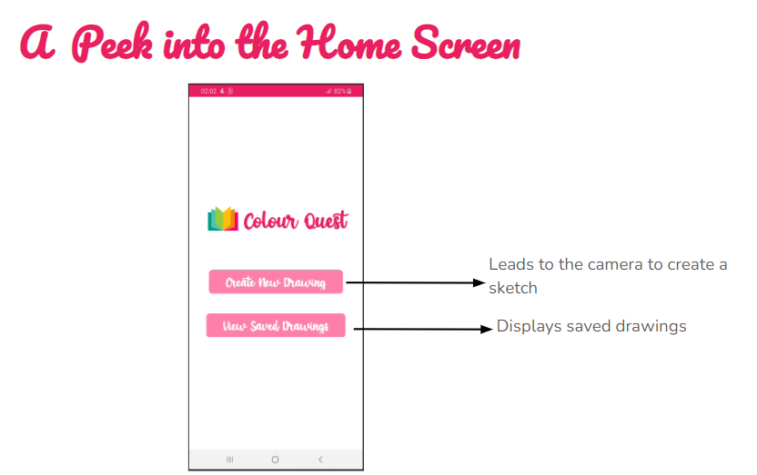
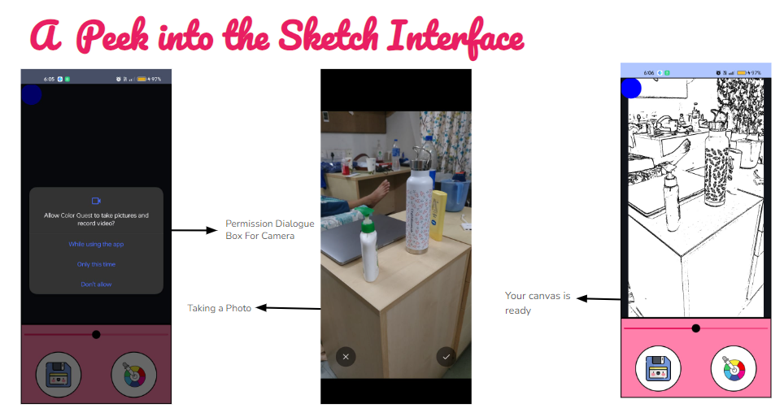
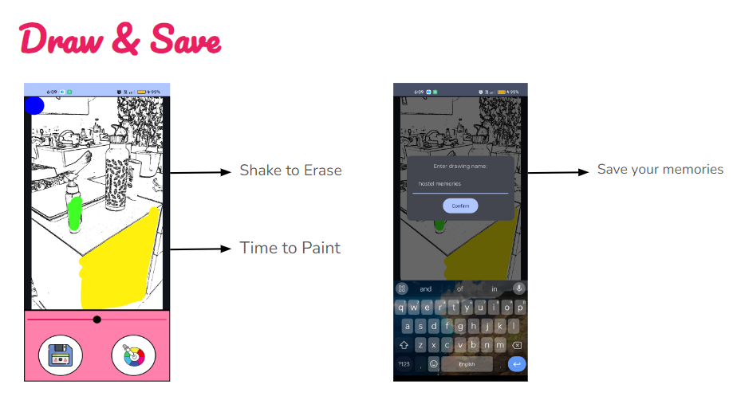
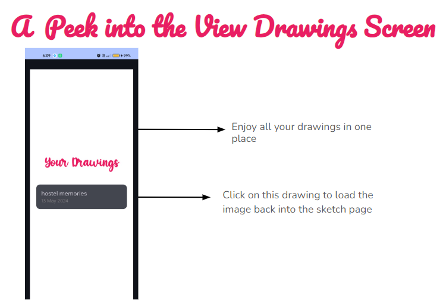

# Color Quest

**Colour Quest** is more than just a coloring app—it's a peaceful retreat for your mind. Designed to reduce stress and foster creativity, Color Quest allows you to snap a photo of anything and turn it into a personalized coloring page. With a rich color palette at your fingertips, you can create and save your masterpieces, revisit them, and add more colors whenever you like. If you're not satisfied with your work, simply shake your phone to start over and let your creativity flow anew.

### :sparkles: Features
- **Snap Photo to Sketch**: Snap a photo of anything you like and the app will generate a black and white coloring sketch.
- **Rich Colour Palette**: Choose from a wide variety of colors to bring your sketches to life.
- **Adjustable Brush Sizes**: Change the brush size to suit your coloring needs.
- **Shake to Clear**: Shake your phone to clear the coloring page and start fresh if you're not happy with your progress.
- **Save and Name Drawings**: Name your drawing and save it for future reference.
- **View Saved Drawings**: Easily view your saved masterpieces in the gallery.
- **Continue Coloring**: Pick any saved drawing and continue coloring where you left off.

### :camera: A Peek into the App

## Authors
This project was developed by
* [Diksha Sethi](https://github.com/dikshasethi2511)
* [Srishti Jain]
* [Tanishk Goyal]
* [Vibhu Dubey]
